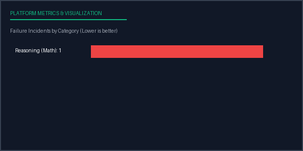

# Evaluation Report: Run 18872ae5-0d1c-48ae-80c9-4c10598530fb
**Date Compiled:** 2026-07-05 10:03:29 UTC
**Execution Status:** completed
**Total Run Duration:** 0.72 seconds

## Configuration Profile
- **Inference Model:** Deepseek Coder V2 (v2026-06 via Mock)
- **Benchmark Dataset:** AGENT EXECUTION V1 (v1.0 - Agent split)
- **Prompt Strategy ID:** cot_v2
- **Parameters:** Temperature=0.7, Top-P=0.95, Max Tokens=256, Seed=42

## Aggregated Metrics Summary
| Target Metric | Value |
| --- | --- |
| Total Samples | 2 |
| Avg Latency | 0.3471 |
| Total Cost | 0.0004 |
| Accuracy | 0.5000 |
| Task Success | 0.0000 |
| Avg Steps | 4.0000 |
| Total Tool Errors | 1 |

## Metrics Performance Chart

## Failure Analysis by Category
| Failure Category | Incidents Count | Sample Failure Example Input |
| --- | --- | --- |
| Reasoning (Math) | 1 | "Sync CRM client accounts and generate the summary invoice report...." |

## Conclusions & Recommendations
- **Implement Few-Shot Prompting:** Baseline task success is low. Consider transitioning from zero-shot to a 3-shot or 5-shot CoT template to prime correct output formatting.