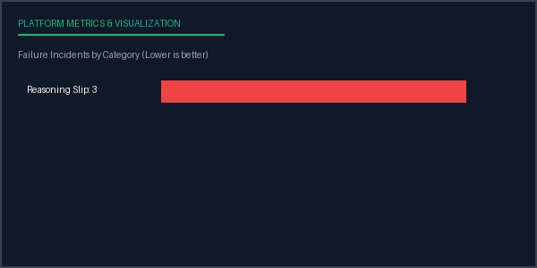

# Evaluation Report: Run 86faba9b-8bc4-4e62-b88e-d33fbcdb5640
**Date Compiled:** 2026-07-05 09:56:11 UTC
**Execution Status:** completed
**Total Run Duration:** 1.53 seconds

## Configuration Profile
- **Inference Model:** Llama 3 8B (v3.0 via Mock)
- **Benchmark Dataset:** ARC Challenge (v1.0 - QA split)
- **Prompt Strategy ID:** zero_shot
- **Parameters:** Temperature=0.1, Top-P=0.9, Max Tokens=512, Seed=42

## Aggregated Metrics Summary
| Target Metric | Value |
| --- | --- |
| Total Samples | 3 |
| Avg Latency | 0.3444 |
| Total Cost | 0.0003 |
| Accuracy | 0.0000 |
| Bleu | 0.0000 |
| Rouge L | 0.0000 |
| Judge Score | 5.0000 |

## Metrics Performance Chart

## Failure Analysis by Category
| Failure Category | Incidents Count | Sample Failure Example Input |
| --- | --- | --- |
| Reasoning Slip | 3 | "What is the capital city of France?..." |

## Conclusions & Recommendations
- **Implement Few-Shot Prompting:** Baseline task success is low. Consider transitioning from zero-shot to a 3-shot or 5-shot CoT template to prime correct output formatting.