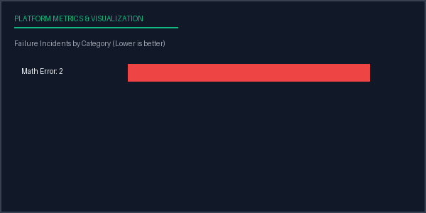

# Evaluation Report: Run run_custom_samples_123
**Date Compiled:** 2026-07-05 10:16:56 UTC
**Execution Status:** completed
**Total Run Duration:** 1.16 seconds

## Configuration Profile
- **Inference Model:** Custom Model (v1.0 via mock)
- **Benchmark Dataset:** Custom DS (v1.0 - Math split)
- **Prompt Strategy ID:** custom_prompt
- **Parameters:** Temperature=0.7, Top-P=0.9, Max Tokens=100, Seed=42

## Aggregated Metrics Summary
| Target Metric | Value |
| --- | --- |
| Total Samples | 2 |
| Avg Latency | 0.3469 |
| Total Cost | 0.0002 |
| Accuracy | 0.0000 |
| Bleu | 0.0000 |
| Rouge L | 0.0000 |
| Judge Score | 5.0000 |

## Metrics Performance Chart

## Failure Analysis by Category
| Failure Category | Incidents Count | Sample Failure Example Input |
| --- | --- | --- |
| Math Error | 2 | "Custom Math query 1?..." |

## Conclusions & Recommendations
- **Implement Few-Shot Prompting:** Baseline task success is low. Consider transitioning from zero-shot to a 3-shot or 5-shot CoT template to prime correct output formatting.